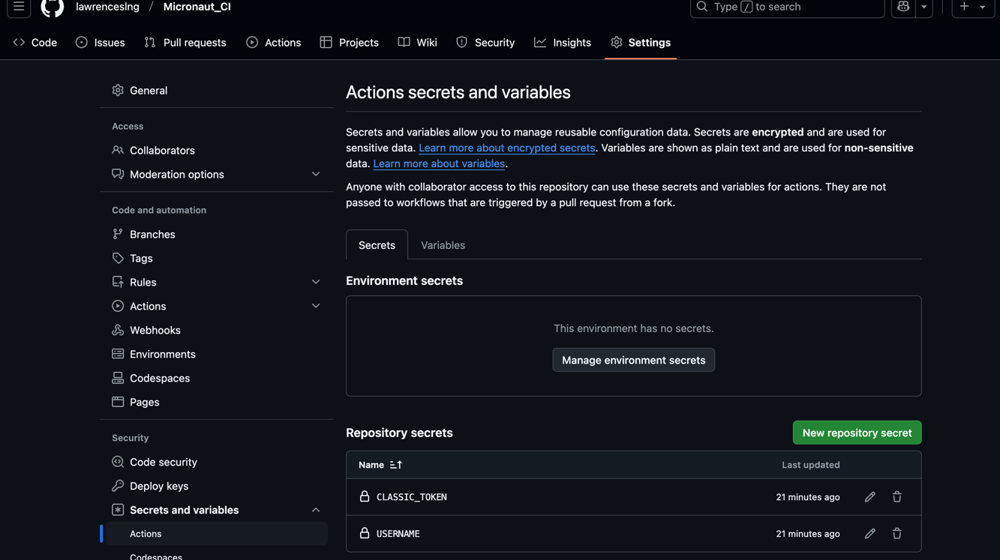

# Assignment #6

This repo demonstrates the use of Github actions and the necessary changes made in order to build and publish the .jar files for an existing Java Micronaut Github repo.

See [this link for the repo that contains the original code](https://github.com/PiyalAhmed/micronaut-crud) and the original README.

## Building a JAR file

To build the application and run the test(s), we had to create a build.yaml file under `.github/workflows/` directory. Below is what is needed to generate the JAR files and make it available for download within the Github repo's Actions tab under each individual workflow run.
```
name: Assignment 6 Build and Deploy Micronaut

on:
  push:
    branches:
      - main  # Trigger after PR merge

jobs:
  build:
    name: Test and Build
    runs-on: ubuntu-latest

    services:
      mysql:
        image: mysql:latest
        env:
          MYSQL_ROOT_PASSWORD: password
          MYSQL_DATABASE: mn_playground
          MYSQL_USER: sherlock
          MYSQL_PASSWORD: elementary
        ports:
          - 3306:3306
        options: >-
          --health-cmd "mysqladmin ping -h 127.0.0.1 -u$MYSQL_USER -p$MYSQL_PASSWORD"
          --health-interval 10s
          --health-timeout 5s
          --health-retries 5

    steps:
      - name: Checkout Code
        uses: actions/checkout@v4

      - name: Set up Java (JDK 21)
        uses: actions/setup-java@v4
        with:
          distribution: 'temurin'
          java-version: '21'

      - name: Set up Gradle
        uses: gradle/actions/setup-gradle@v3
        with:
          gradle-version: "8.10" # Quotes required to prevent YAML converting to number

      - name: Build with Gradle 8.10
        run: gradle build

      - name: Verify JAR File Exists
        run: ls -lh build/libs/

      - name: Upload build artifacts
        uses: actions/upload-artifact@v4
        with:
          name: Package
          path: build/libs/*.jar
```
Note that we spun up a Docker container with a MySQL DB so that the build is successful.

So changes to the `src/main/resources/application.yaml` also has to be made:
```
datasources:
  default:
    url: jdbc:mysql://localhost:3306/mn_playground
    username: sherlock
    password: elementary
    driver-class-name: com.mysql.cj.jdbc.Driver
```

The artifact at the bottom of this screenshot contains the JAR files available for download:


## BONUS: Sending the JAR files somewhere...

After the JAR files are created, they can be sent to registries. In this example, we send it to the [Gradle registry with Github Packages](https://docs.github.com/en/packages/working-with-a-github-packages-registry/working-with-the-gradle-registry).

We add the following to the `build.yaml` file:

```
  - name: Publish package
    run: gradle publish
    env:
        USERNAME: ${{ secrets.USERNAME }}
        TOKEN: ${{ secrets.CLASSIC_TOKEN }}
```

We created a [personal access token on Github](https://docs.github.com/en/authentication/keeping-your-account-and-data-secure/managing-your-personal-access-tokens#creating-a-personal-access-token-classic) and added our Github username and this token as a secret in the repo:


In `build.gradle` we added the following:

```
plugins {
    ...
    id("maven-publish")
}

publishing {
    repositories {
        maven {
            name = "GitHubPackages"
            url = "https://maven.pkg.github.com/lawrenceslng/Micronaut_CI"
            credentials {
                username = project.findProperty("gpr.user") ?: System.getenv("USERNAME")
                password = project.findProperty("gpr.key") ?: System.getenv("TOKEN")
            }
        }
    }
    publications {
        gpr(MavenPublication) {
            from(components.java)
        }
    }
}
```

The package is then published as shown in the lower right corner of the repo here:

